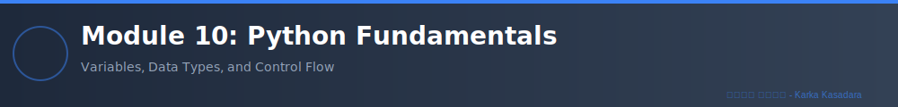

# Module 10: Python Fundamentals

**Duration**: 2 weeks (40-50 hours)  
**Difficulty**: ⭐ Beginner  
**Prerequisites**: None - Fresh start for SQL data engineers

---

## 🎯 Module Overview

Welcome to Python! This module introduces you to Python programming from scratch. By the end of this module, you'll be comfortable writing Python scripts, working with data structures, and building functions—essential skills for data engineering.

**Why Python for Data Engineers?**
- Industry standard for data processing
- Seamless integration with databases
- Rich ecosystem (Pandas, PySpark, SQLAlchemy)
- Easy to learn, powerful to use

---

## 📚 Learning Objectives

By completing this module, you will be able to:

✅ Install and configure Python development environment  
✅ Write Python scripts with proper syntax  
✅ Use variables, data types, and operators  
✅ Work with lists, tuples, dictionaries, and sets  
✅ Implement control flow (if/else, loops)  
✅ Create and use functions effectively  
✅ Handle strings and perform text processing  
✅ Read and write files (CSV, text)  
✅ Debug and handle basic errors  
✅ Apply Python to solve data problems

---

## 🗂️ Module Structure

### **Section 1: Python Setup & Basics** (6 hours)
- Installing Python 3.11+
- VS Code setup and extensions
- Virtual environments with venv
- First Python program
- Variables and data types
- Type hints and conversion

📄 Files: `01_python_setup.md`, `02_variables_datatypes.md`  
🧪 Labs: Lab 01 - Variables and Data Types

---

### **Section 2: Data Structures** (10 hours)
- **Lists**: Creation, indexing, slicing, methods
- **Tuples**: Immutability, packing/unpacking
- **Dictionaries**: Key-value pairs, methods, use cases
- **Sets**: Unique elements, set operations
- List comprehensions

📄 Files: `03_lists.md`, `04_tuples.md`, `05_dictionaries.md`, `06_sets.md`  
🧪 Labs: Lab 02 - Lists, Lab 03 - Dictionaries

---

### **Section 3: Control Flow** (8 hours)
- **Conditional statements**: if, elif, else
- **Loops**: for loops with range, enumerate, zip
- **while loops** and loop control
- break, continue, pass statements
- Nested loops

📄 Files: `07_conditionals.md`, `08_loops.md`  
🧪 Labs: Lab 04 - Control Flow, Lab 05 - Loops and Iterations

---

### **Section 4: Functions** (10 hours)
- Defining functions
- Parameters and arguments
- Return values
- Default parameters
- *args and **kwargs
- Lambda functions
- Scope and global variables
- Docstrings

📄 Files: `09_functions.md`, `10_lambda_functions.md`  
🧪 Labs: Lab 06 - Functions Basics, Lab 07 - Advanced Functions

---

### **Section 5: String Manipulation** (6 hours)
- String methods (split, join, strip, replace, find)
- String formatting (f-strings, format())
- String slicing
- Regular expressions basics
- Text file processing

📄 Files: `11_strings.md`, `12_regex_basics.md`  
🧪 Labs: Lab 08 - String Processing

---

### **Section 6: File Operations** (5 hours)
- Reading text files
- Writing text files
- CSV file handling
- Context managers (with statement)
- File paths and os module

📄 Files: `13_file_operations.md`  
🧪 Labs: Lab 09 - Working with Files

---

### **Section 7: Error Handling Basics** (3 hours)
- try/except blocks
- Handling specific exceptions
- finally clause
- Common Python exceptions

📄 Files: `14_error_handling.md`  
🧪 Labs: Lab 10 - Error Handling

---

### **Section 8: Practical Project** (4 hours)
- Mini-project: Data analysis script
- Reading CSV data
- Processing and filtering
- Calculating statistics
- Writing output

🧪 Labs: Lab 11 - Mini Project: Sales Data Analysis

---

## 🧪 Hands-On Labs

| Lab | Title | Difficulty | Estimated Time |
|-----|-------|------------|----------------|
| **01** | Variables and Data Types | ⭐ | 1 hour |
| **02** | Lists and List Comprehensions | ⭐ | 2 hours |
| **03** | Dictionary Operations | ⭐⭐ | 2 hours |
| **04** | Control Flow - Decision Making | ⭐ | 1.5 hours |
| **05** | Loops and Iterations | ⭐⭐ | 2 hours |
| **06** | Functions - Basics | ⭐⭐ | 2 hours |
| **07** | Advanced Functions - *args/**kwargs | ⭐⭐⭐ | 2 hours |
| **08** | String Processing | ⭐⭐ | 2 hours |
| **09** | Working with Files (CSV) | ⭐⭐ | 2 hours |
| **10** | Error Handling | ⭐⭐ | 1.5 hours |
| **11** | Mini Project: Sales Data Analysis | ⭐⭐⭐ | 4 hours |

**Total Lab Time**: ~22 hours

---

## 📝 Assessments

### **Quiz 1: Python Basics** (After Section 3)
- 20 multiple-choice questions
- Topics: Variables, data types, data structures, control flow
- Passing score: 70%
- Time: 30 minutes

### **Quiz 2: Functions and Advanced Concepts** (After Section 7)
- 15 multiple-choice questions
- Topics: Functions, lambda, strings, files, error handling
- Passing score: 70%
- Time: 25 minutes

---

## 🛠️ Required Tools

### Software:
1. **Python 3.11+** - [Download](https://www.python.org/downloads/)
2. **VS Code** - [Download](https://code.visualstudio.com/)
3. **VS Code Python Extension** - Install from Extensions marketplace
4. **Git** (optional but recommended)

### VS Code Extensions:
- Python (Microsoft)
- Pylance
- Python Indent
- Jupyter (for future modules)

---

## 📖 Installation Guide

### Step 1: Install Python
```bash
# Windows (using winget)
winget install Python.Python.3.11

# Or download from python.org
# During installation, CHECK "Add Python to PATH"
```

### Step 2: Verify Installation
```bash
python --version
# Should show: Python 3.11.x or later

pip --version
# Should show pip version
```

### Step 3: Install VS Code
Download and install from https://code.visualstudio.com/

### Step 4: Setup VS Code for Python
1. Open VS Code
2. Go to Extensions (Ctrl+Shift+X)
3. Search "Python" and install Microsoft's Python extension
4. Search "Pylance" and install

### Step 5: Create Virtual Environment
```bash
# Navigate to your project folder
cd C:\Projects\PythonDataEngineering

# Create virtual environment
python -m venv venv

# Activate it (Windows)
venv\Scripts\activate

# You should see (venv) in your terminal
```

### Step 6: Install Initial Packages
```bash
pip install ipython pytest
```

---

## 📂 Module File Structure

```
Module_10_Python_Fundamentals/
│
├── README.md (this file)
├── 01_python_setup.md
├── 02_variables_datatypes.md
├── 03_lists.md
├── 04_tuples.md
├── 05_dictionaries.md
├── 06_sets.md
├── 07_conditionals.md
├── 08_loops.md
├── 09_functions.md
├── 10_lambda_functions.md
├── 11_strings.md
├── 12_regex_basics.md
├── 13_file_operations.md
├── 14_error_handling.md
│
├── labs/
│   ├── lab_01_variables.py
│   ├── lab_02_lists.py
│   ├── lab_03_dictionaries.py
│   ├── lab_04_control_flow.py
│   ├── lab_05_loops.py
│   ├── lab_06_functions.py
│   ├── lab_07_advanced_functions.py
│   ├── lab_08_strings.py
│   ├── lab_09_files.py
│   ├── lab_10_error_handling.py
│   └── lab_11_mini_project.py
│
├── solutions/
│   ├── lab_01_solution.py
│   ├── lab_02_solution.py
│   └── ... (all lab solutions)
│
├── quizzes/
│   ├── quiz_01_basics.md
│   └── quiz_02_functions.md
│
└── data/
    ├── sample_sales.csv
    ├── customers.txt
    └── products.json
```

---

## 🎯 Learning Tips

### For SQL Engineers Learning Python:

**Similarities to SQL:**
- Both use logical operators (AND, OR, NOT)
- Similar control flow concepts
- Python lists ≈ SQL result sets
- Python dictionaries ≈ SQL rows

**Key Differences:**
- Python is case-sensitive
- Indentation matters (no BEGIN/END blocks)
- Zero-based indexing
- More flexible data structures

### Best Practices:
1. **Practice daily** - Write code every day, even 30 minutes
2. **Type code manually** - Don't copy-paste, build muscle memory
3. **Use print()** liberally - Debug by printing values
4. **Read error messages** - Python errors are helpful!
5. **Comment your code** - Explain why, not what
6. **Use meaningful names** - `customer_name` not `cn`

---

## 📚 Recommended Resources

### Official Documentation:
- [Python.org Tutorial](https://docs.python.org/3/tutorial/)
- [Python Standard Library](https://docs.python.org/3/library/)

### Practice Platforms:
- [HackerRank Python](https://www.hackerrank.com/domains/python)
- [LeetCode Easy Problems](https://leetcode.com/)
- [Codewars Python](https://www.codewars.com/)

### Books (Free):
- "Automate the Boring Stuff with Python" by Al Sweigart
- "Think Python" by Allen Downey

---

## ✅ Module Completion Checklist

- [ ] Python installed and verified
- [ ] VS Code configured with Python extension
- [ ] Completed all 14 section readings
- [ ] Completed all 11 labs
- [ ] Passed Quiz 1 with 70%+
- [ ] Passed Quiz 2 with 70%+
- [ ] Completed mini project
- [ ] Created at least 3 custom Python scripts

**Time to Complete**: 40-50 hours over 2 weeks  
**Next Module**: Module 11 - Advanced Python & OOP

---

## 🤝 Getting Help

- **GitHub Issues**: [Report issues](https://github.com/karkakasadara-tharavu/zero-to-data-engineer/issues)
- **GitHub Discussions**: [Ask questions](https://github.com/karkakasadara-tharavu/zero-to-data-engineer/discussions)

---

**கற்க கசடற** - Learn Flawlessly

*Start your Python journey today!*

