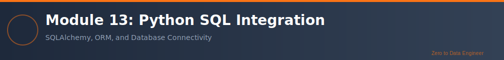

# Module 13: Python + SQL Integration

**Duration**: 2 weeks (40-50 hours)  
**Difficulty**: ⭐⭐⭐ Advanced  
**Prerequisites**: Modules 10-12, SQL Track Recommended

---

## Overview

Welcome to **Module 13: Python + SQL Integration**! This module bridges your Python and SQL knowledge, teaching you how to connect Python applications to databases, execute queries programmatically, and integrate pandas with SQL databases. You'll master essential libraries like pyodbc, SQLAlchemy, and learn best practices for database-driven applications.

## Learning Objectives

1. **Database Connectivity**: Connect Python to SQL Server, PostgreSQL, MySQL
2. **Execute SQL from Python**: Run queries programmatically
3. **Parameterized Queries**: Prevent SQL injection with safe queries
4. **Transaction Management**: Handle commits, rollbacks, and transactions
5. **SQLAlchemy ORM**: Use Object-Relational Mapping for database operations
6. **Pandas Integration**: Load/save DataFrames to/from databases
7. **Connection Pooling**: Manage database connections efficiently
8. **Error Handling**: Handle database errors gracefully
9. **Data Migration**: Move data between systems
10. **Best Practices**: Write production-ready database code

## Prerequisites

- Module 10: Python Fundamentals
- Module 11: Advanced Python & OOP
- Module 12: Data Processing with Pandas
- Modules 00-09: SQL Track (strongly recommended)

## Module Structure

### Theory Sections
1. Database connectivity with pyodbc
2. Executing SQL queries from Python
3. Parameterized queries and SQL injection prevention
4. Transaction management and error handling
5. SQLAlchemy Core - SQL expression language
6. SQLAlchemy ORM - Object-relational mapping
7. Pandas and SQL integration
8. Connection pooling and performance
9. Database migrations and schema management
10. Production best practices

### Labs
1. Connect to databases and execute queries
2. CRUD operations with pyodbc
3. Parameterized queries and prepared statements
4. Transaction management
5. SQLAlchemy Core operations
6. SQLAlchemy ORM models
7. Pandas DataFrame to/from SQL
8. Data pipeline with Python + SQL
9. ETL process implementation
10. Capstone: Complete database application

## Real-World Applications

- Data pipeline development
- ETL process automation
- Database-backed web applications
- Data migration tools
- Reporting systems
- Analytics platforms

## Time Commitment: 40-50 hours

---

## 🔗 Navigation

| Direction | Link |
|-----------|------|
| ⬅️ Previous | [Module 12: Data Processing with Pandas](../Module_12_Data_Processing_Pandas/) |
| ➡️ Next | [Module 14: Apache Spark Introduction](../Module_14_Apache_Spark_Intro/) |
| 🏠 Home | [Main Curriculum](../README.md) |
| 📚 Resources | [Study Materials](../Resources/) |

---

**ඕற்க கசடற** - Learn Flawlessly
