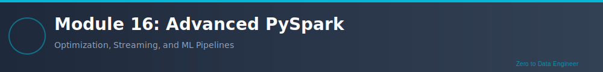

# Module 16: Advanced PySpark

**Duration**: 2 weeks (40-50 hours)  
**Difficulty**: ⭐⭐⭐⭐ Expert  
**Prerequisites**: Module 15 - PySpark Fundamentals

---

## Overview

Welcome to **Module 16: Advanced PySpark**! This module takes your PySpark skills to the next level with advanced techniques for performance optimization, complex transformations, streaming data, and production-ready data engineering patterns.

## Learning Objectives

1. **Advanced Transformations**: Complex data manipulations
2. **Window Functions Mastery**: Ranking, lead, lag, cumulative operations
3. **Performance Optimization**: Partitioning, bucketing, caching strategies
4. **Broadcast Joins**: Optimize joins for large-scale data
5. **Custom Aggregations**: Build complex aggregation logic
6. **Data Quality**: Validation and data quality checks
7. **Streaming Basics**: Introduction to Spark Structured Streaming
8. **Advanced I/O**: Efficient reading/writing strategies
9. **Catalyst Optimizer**: Understanding query optimization
10. **Production Patterns**: Best practices for production deployments

## Prerequisites

- Module 10-14: Complete Python and Spark foundation
- Module 15: PySpark Fundamentals
- Strong understanding of DataFrames and SQL

## Module Structure

### Theory Sections
1. Advanced DataFrame operations
2. Window functions deep dive
3. Partitioning and bucketing strategies
4. Broadcast variables and accumulators
5. Performance tuning and optimization
6. Memory management
7. Spark Structured Streaming introduction
8. Data quality and validation
9. Testing PySpark applications
10. Production deployment best practices

### Labs
1. Complex window functions
2. Performance optimization techniques
3. Broadcast joins implementation
4. Custom aggregation functions
5. Partitioning strategies
6. Incremental data processing
7. Streaming data basics
8. Data quality framework
9. PySpark unit testing
10. Capstone: Production-ready data pipeline

## Real-World Applications

- Enterprise ETL pipelines
- Real-time analytics
- Data warehouse loading
- ML feature engineering at scale
- Data quality frameworks
- Production data platforms

## Time Commitment: 40-50 hours

---

**கற்க கசடற** - Learn Flawlessly
