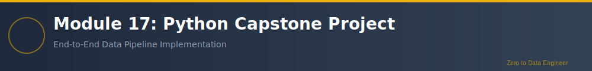

# Module 17: Python Data Engineering Capstone Project

**Duration**: 3-4 weeks (60-80 hours)  
**Difficulty**: ⭐⭐⭐⭐⭐ Expert  
**Prerequisites**: Modules 10-16 (Complete Python Track)

---

## Overview

Welcome to **Module 17: Python Data Engineering Capstone Project**! This is your final project where you'll apply everything you've learned from Modules 10-16 to build a complete, production-ready data engineering solution. You'll design and implement an end-to-end data pipeline demonstrating your mastery of Python, SQL, pandas, and PySpark.

## Project Overview

Build a comprehensive data engineering solution that includes:
- Data ingestion from multiple sources
- Data quality validation and cleansing
- Data transformation and enrichment
- Data storage and retrieval
- Analytics and reporting
- Monitoring and logging
- Documentation and testing

## Learning Objectives

1. **System Design**: Architecture a complete data pipeline
2. **Data Ingestion**: Collect data from APIs, databases, files
3. **ETL Pipeline**: Extract, transform, load at scale
4. **Data Quality**: Implement validation and monitoring
5. **Performance**: Optimize for speed and efficiency
6. **Testing**: Unit tests, integration tests
7. **Logging**: Comprehensive logging and debugging
8. **Documentation**: Professional documentation
9. **Deployment**: Production-ready code
10. **Best Practices**: Apply industry standards

## Project Requirements

### Core Components
1. **Data Sources**: At least 3 different data sources (CSV, JSON, API, database)
2. **Python Pipeline**: OOP-based pipeline architecture
3. **Pandas Processing**: Data cleaning and transformation
4. **SQL Integration**: Database reads/writes
5. **PySpark Processing**: Large-scale data processing
6. **Data Quality**: Validation framework
7. **Error Handling**: Comprehensive error management
8. **Logging**: Structured logging throughout
9. **Testing**: Unit and integration tests
10. **Documentation**: Complete README and code documentation

### Technical Requirements
- Python 3.11+
- Pandas for data manipulation
- SQL Server/PostgreSQL integration
- PySpark for big data processing
- pytest for testing
- Logging framework
- Configuration management
- Version control (Git)

## Project Phases

### Phase 1: Planning (Week 1)
- Define business problem
- Design system architecture
- Plan data model
- Create project structure

### Phase 2: Development (Weeks 2-3)
- Implement data ingestion
- Build transformation logic
- Create data quality checks
- Develop PySpark processing

### Phase 3: Testing & Optimization (Week 4)
- Write comprehensive tests
- Performance optimization
- Error handling refinement
- Documentation completion

### Phase 4: Deployment & Presentation (Week 5)
- Deployment preparation
- Create presentation
- Demonstrate pipeline
- Submit final project

## Sample Project Ideas

1. **E-commerce Analytics Pipeline**
   - Ingest sales, customer, product data
   - Process orders and inventory
   - Generate business intelligence reports
   - Real-time dashboard updates

2. **Social Media Analytics**
   - Collect data from APIs
   - Sentiment analysis
   - Trend detection
   - Visualization dashboard

3. **Financial Data Pipeline**
   - Stock market data ingestion
   - Technical indicator calculation
   - Portfolio analysis
   - Risk metrics computation

4. **IoT Data Processing**
   - Sensor data collection
   - Real-time anomaly detection
   - Aggregations and statistics
   - Alert system

5. **Log Analysis System**
   - Web server log processing
   - User behavior analysis
   - Performance monitoring
   - Security event detection

## Deliverables

1. **Source Code**: Complete, well-organized codebase
2. **Documentation**: README, architecture diagrams, API docs
3. **Tests**: Comprehensive test suite
4. **Presentation**: Project demonstration (15-20 minutes)
5. **Report**: Technical report (10-15 pages)

## Evaluation Criteria

- **Architecture & Design** (20%): System design quality
- **Code Quality** (20%): Clean, maintainable, OOP principles
- **Functionality** (20%): All requirements met, works correctly
- **Performance** (15%): Efficient processing, optimization
- **Testing** (10%): Comprehensive test coverage
- **Documentation** (10%): Clear, complete documentation
- **Presentation** (5%): Effective communication

## Time Commitment

- **Planning**: 10-15 hours
- **Development**: 40-50 hours
- **Testing**: 15-20 hours
- **Documentation**: 10-15 hours
- **Presentation Prep**: 5-10 hours
- **Total**: 80-110 hours (4-5 weeks full-time)

## Support Resources

- All previous module materials
- Code examples from Modules 10-16
- Sample projects and templates
- Office hours with instructors
- Peer collaboration encouraged

## Success Tips

✅ **Start with MVP** - Build minimum viable product first  
✅ **Iterate rapidly** - Small, frequent improvements  
✅ **Test continuously** - Write tests as you develop  
✅ **Document early** - Don't leave it to the end  
✅ **Seek feedback** - Regular check-ins with mentors  
✅ **Version control** - Commit frequently with clear messages  
✅ **Think production** - Build like it's going to production  
✅ **Showcase skills** - This is your portfolio piece!  

## Learning Outcomes

Upon completion, you will have:
- A portfolio-worthy data engineering project
- Hands-on experience with complete pipeline development
- Demonstrated mastery of Python data stack
- Production-ready code examples
- Confidence to tackle real-world data engineering challenges

## Next Steps After Completion

- **Job Applications**: Use project in portfolio
- **Further Learning**: Advanced topics (Kafka, Airflow, Kubernetes)
- **Certifications**: Databricks, AWS, Azure certifications
- **Open Source**: Contribute to open source projects
- **Networking**: Share project, connect with community

---

## Congratulations!

Completing this capstone marks the end of your journey from zero to data engineer. You've mastered:
- Python fundamentals and OOP
- Data processing with pandas
- SQL integration
- Apache Spark and PySpark
- Production-ready data pipelines

**You are now a Data Engineer!** 🎉

---

## 🔗 Navigation

| Direction | Link |
|-----------|------|
| ⬅️ Previous | [Module 16: Advanced PySpark](../Module_16_Advanced_PySpark/) |
| 🏠 Home | [Main Curriculum](../README.md) |
| 📚 Resources | [Study Materials](../Resources/) |

---

**கற்க கசடற** - Learn Flawlessly

**From Zero to Data Engineer**: Complete Curriculum | 320+ Hours | Production-Ready Skills
