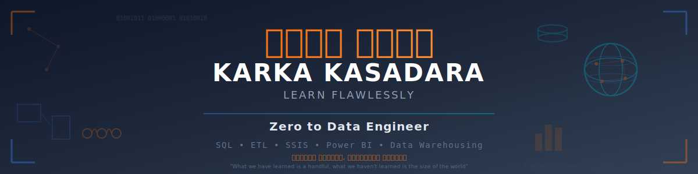

# 🎓 Complete Data Engineering Curriculum
### From Database Fundamentals to Production-Ready Data Engineer



---

## 🌟 Welcome to Karka Kasadara

**Karka Kasadara** (கற்க கசடற - *Learn Flawlessly* in Tamil) represents our mission: to provide a clear, structured, and comprehensive path for anyone aspiring to master Data Engineering—without the confusion, without the gaps.

### Our Mission

We believe that **quality education should be accessible to everyone**. Whether you're a fresh BE graduate, a career switcher from mechanical or civil engineering, or a working professional looking to upskill, this curriculum is designed to guide you step-by-step from fundamentals to job-ready expertise.

**Karka Kasadara is not just a curriculum—it's a learning journey.**

This open-source curriculum enables learners to:
- 💡 Master data engineering skills step-by-step
- 🤝 Learn from detailed examples and best practices
- 🌱 Build production-ready projects for your portfolio
- 🎯 Transform from BE graduate to job-ready professional

**Learn flawlessly. Build amazing things with data.**

---

## 📊 Course Overview

A comprehensive, hands-on curriculum designed to transform BE graduates into **job-ready Data Engineers** with expertise in:

- ✅ **Database Management & Administration** (SQL Server)
- ✅ **ETL & Data Integration** (SSIS, Advanced Patterns)
- ✅ **Business Intelligence & Reporting** (Power BI)
- ✅ **Real-World Project Experience** (Capstone)

**Duration**: 14-16 weeks | **Hands-On Labs**: 100+ exercises | **Difficulty**: Beginner → Expert

---

## 🗂️ Curriculum Structure

### 📊 SQL Track (Modules 00-09)

| Module | Topic | Duration | Difficulty |
|--------|-------|----------|------------|
| **[00](./Module_00_Introduction/)** | Introduction & Career Guide | 1 day | ⭐ Beginner |
| **[01](./Module_01_SQL_Server_Setup/)** | SQL Server Installation & Configuration | 2 days | ⭐ Beginner |
| **[02](./Module_02_SQL_Fundamentals/)** | SQL Fundamentals (SELECT, JOIN, Aggregations) | 2 weeks | ⭐⭐ Intermediate |
| **[03](./Module_03_Advanced_SQL/)** | Advanced SQL (CTEs, Window Functions) | 2 weeks | ⭐⭐⭐ Advanced |
| **[04](./Module_04_Database_Administration/)** | Database Design & Administration | 2 weeks | ⭐⭐⭐ Advanced |
| **[05](./Module_05_TSQL_Programming/)** | T-SQL Programming (Procedures, Functions) | 2 weeks | ⭐⭐⭐ Advanced |
| **[06](./Module_06_ETL_SSIS/)** | ETL with SSIS Fundamentals | 2 weeks | ⭐⭐⭐ Intermediate |
| **[07](./Module_07_Advanced_ETL/)** | Advanced ETL Patterns & CDC | 2 weeks | ⭐⭐⭐⭐ Advanced |
| **[08](./Module_08_PowerBI/)** | Power BI Reporting & Analytics | 2 weeks | ⭐⭐⭐ Intermediate |
| **[09](./Module_09_SQL_Capstone/)** | SQL Capstone: Data Warehouse Project | 2 weeks | ⭐⭐⭐⭐ Expert |

### 🐍 Python Track (Modules 10-17)

| Module | Topic | Duration | Difficulty |
|--------|-------|----------|------------|
| **[10](./Module_10_Python_Fundamentals/)** | Python Fundamentals | 2 weeks | ⭐⭐ Intermediate |
| **[11](./Module_11_Advanced_Python_OOP/)** | Advanced Python & OOP | 2 weeks | ⭐⭐⭐ Advanced |
| **[12](./Module_12_Data_Processing_Pandas/)** | Data Processing with Pandas | 2 weeks | ⭐⭐⭐ Advanced |
| **[13](./Module_13_Python_SQL_Integration/)** | Python-SQL Integration (SQLAlchemy) | 2 weeks | ⭐⭐⭐ Advanced |
| **[14](./Module_14_Apache_Spark_Intro/)** | Apache Spark Introduction | 1 week | ⭐⭐⭐ Intermediate |
| **[15](./Module_15_PySpark_Fundamentals/)** | PySpark Fundamentals | 2 weeks | ⭐⭐⭐ Advanced |
| **[16](./Module_16_Advanced_PySpark/)** | Advanced PySpark (Delta Lake, Streaming) | 2 weeks | ⭐⭐⭐⭐ Expert |
| **[17](./Module_17_Python_Capstone/)** | Python Capstone: End-to-End Pipeline | 2 weeks | ⭐⭐⭐⭐ Expert |

### 📚 Resources

| Resource | Description |
|----------|-------------|
| **[Resources](./Resources/)** | Cheat Sheets, Interview Guides, Practice Problems |

---

## 🎯 Learning Outcomes

By completing this curriculum, learners will be able to:

### Database Management & SQL
- ✅ Design normalized database schemas (3NF, BCNF)
- ✅ Write optimized SQL queries with indexing strategies
- ✅ Implement backup/recovery and high-availability solutions
- ✅ Manage security, roles, and permissions

### ETL & Data Engineering
- ✅ Build robust ETL pipelines using SSIS
- ✅ Implement Change Data Capture (CDC) for incremental loads
- ✅ Handle complex data transformations and error scenarios
- ✅ Orchestrate multi-step data workflows

### Reporting & Analytics
- ✅ Create star/snowflake schema data models
- ✅ Develop interactive Power BI dashboards
- ✅ Write advanced DAX calculations
- ✅ Deploy and maintain production reports

### Professional Skills
- ✅ Debug and troubleshoot production issues
- ✅ Document technical solutions
- ✅ Follow industry best practices and design patterns
- ✅ Complete portfolio-ready capstone project

---

## 🛠️ Technology Stack

All tools used are **free** and industry-standard:

| Category | Tool | Version | Download Link |
|----------|------|---------|---------------|
| **Database** | SQL Server Express | 2022 | [Download](https://www.microsoft.com/en-us/sql-server/sql-server-downloads) |
| **Management Studio** | SSMS | 20.x | [Download](https://learn.microsoft.com/en-us/sql/ssms/download-sql-server-management-studio-ssms) |
| **Sample Database** | AdventureWorks2022 | Latest | [Download](https://learn.microsoft.com/en-us/sql/samples/adventureworks-install-configure) |
| **ETL Tool** | SSIS (SQL Server Data Tools) | 2022 | [Download](https://learn.microsoft.com/en-us/sql/ssdt/download-sql-server-data-tools-ssdt) |
| **BI Tool** | Power BI Desktop | Latest | [Download](https://www.microsoft.com/en-us/download/details.aspx?id=58494) |

---

## 🚀 Getting Started

### Prerequisites

**Required Knowledge:**
- Basic programming concepts (variables, loops, conditions)
- Familiarity with Windows OS
- Understanding of relational data concepts (tables, relationships)

**Optional but Helpful:**
- Any BE/BTech degree (CS/IT/Electronics/Mechanical - all welcome!)
- Basic Excel skills
- Curiosity and willingness to learn!

### Setup Instructions

1. **Clone this repository**
   ```powershell
   git clone https://github.com/karkakasadara-tharavu/zero-to-data-engineer.git
   cd zero-to-data-engineer
   ```

2. **Follow Module 01** for complete installation guide
   - Install SQL Server Express 2022
   - Install SSMS
   - Restore AdventureWorks2022 database
   - Verify setup with test queries

3. **Start with Module 02** and progress sequentially

---

## 📚 How to Use This Curriculum

### Self-Paced Learning Path

**Weeks 1-2**: Foundation Setup
- Complete Module 00 (read prerequisites, assessment criteria)
- Complete Module 01 (install all tools)
- Start Module 02 (basic SQL queries)

**Weeks 3-6**: SQL Mastery
- Complete Module 02 & 03 (SQL fundamentals & advanced)
- Practice labs daily (minimum 2 hours/day)
- Complete weekly assessments

**Weeks 7-10**: Database Administration & Programming
- Complete Module 04 (DB design, indexing, backup)
- Complete Module 05 (stored procedures, functions)
- Work on mini-projects

**Weeks 11-14**: ETL & Reporting
- Complete Module 06 & 07 (SSIS fundamentals & advanced)
- Complete Module 08 (Power BI)
- Start capstone project planning

**Weeks 15-16**: Capstone Project
- Complete end-to-end data warehouse project
- Document and present solution
- Build portfolio artifacts

### Instructor-Led Training Path

Each module includes:
- 📖 **Lecture Notes**: Theory with real-world examples
- 💻 **Demo Scripts**: Instructor walkthroughs
- 🧪 **Hands-On Labs**: Student exercises (beginner → expert)
- ✅ **Assessments**: Quizzes and practical exams
- 🎯 **Projects**: Mini-projects per module

---

## 📂 Repository Structure

```
DataEngineer_Curriculum/
│
├── README.md                          # This file
├── LICENSE                            # MIT License
├── .gitignore                         # Git ignore rules
│
├── assets/                            # Shared resources
│   ├── images/                        # Diagrams, screenshots
│   │   └── banner.png                 # Optional: Custom banner
│   ├── templates/                     # Document templates
│   │   ├── lab_report_template.md
│   │   ├── project_rubric_template.md
│   │   └── sql_script_template.sql
│   └── downloads/                     # Quick access to installers info
│       └── tool_links.md
│
├── Module_00_Curriculum_Overview/
│   ├── README.md                      # Module overview
│   ├── 01_learning_objectives.md
│   ├── 02_prerequisites_checklist.md
│   ├── 03_assessment_framework.md
│   └── 04_career_roadmap.md
│
├── Module_01_SQL_Server_Setup/
│   ├── README.md
│   ├── 01_sql_server_installation.md
│   ├── 02_ssms_setup_guide.md
│   ├── 03_adventureworks_setup.md
│   ├── 04_verification_tests.sql
│   └── screenshots/                   # Installation screenshots
│
├── Module_02_SQL_Fundamentals/
│   ├── README.md
│   ├── 01_select_basics.md
│   ├── 02_filtering_sorting.md
│   ├── 03_joins_relationships.md
│   ├── 04_aggregations_grouping.md
│   ├── 05_subqueries.md
│   ├── labs/
│   │   ├── lab_01_basic_queries.sql
│   │   ├── lab_02_joins.sql
│   │   └── ... (25+ labs)
│   └── solutions/                     # Lab answer keys
│
├── Module_03_SQL_Advanced/
│   ├── README.md
│   ├── 01_ctes_recursive_queries.md
│   ├── 02_window_functions.md
│   ├── 03_query_optimization.md
│   ├── 04_execution_plans.md
│   ├── labs/
│   └── solutions/
│
├── Module_04_Database_Administration/
│   ├── README.md
│   ├── 01_database_design_normalization.md
│   ├── 02_indexes_performance.md
│   ├── 03_backup_recovery.md
│   ├── 04_security_permissions.md
│   ├── labs/
│   └── solutions/
│
├── Module_05_TSQL_Programming/
│   ├── README.md
│   ├── 01_stored_procedures.md
│   ├── 02_functions_udf.md
│   ├── 03_triggers.md
│   ├── 04_error_handling.md
│   ├── 05_dynamic_sql.md
│   ├── labs/
│   └── solutions/
│
├── Module_06_ETL_SSIS/
│   ├── README.md
│   ├── 01_ssis_architecture.md
│   ├── 02_control_flow.md
│   ├── 03_data_flow.md
│   ├── 04_transformations.md
│   ├── projects/                      # SSIS package samples
│   └── solutions/
│
├── Module_07_Advanced_ETL/
│   ├── README.md
│   ├── 01_change_data_capture.md
│   ├── 02_incremental_loads.md
│   ├── 03_error_handling_logging.md
│   ├── 04_orchestration_patterns.md
│   ├── projects/
│   └── solutions/
│
├── Module_08_PowerBI/
│   ├── README.md
│   ├── 01_data_modeling.md
│   ├── 02_dax_fundamentals.md
│   ├── 03_visualizations.md
│   ├── 04_deployment_bestpractices.md
│   ├── pbix_files/                    # Sample reports
│   └── solutions/
│
└── Module_09_Capstone/
    ├── README.md
    ├── 01_project_requirements.md
    ├── 02_architecture_design.md
    ├── 03_implementation_guide.md
    ├── 04_evaluation_rubric.md
    └── sample_solution/               # Reference implementation
```

---

## 🎓 Assessment & Certification

### Progress Tracking

Each module includes:
- **Daily Labs**: Hands-on exercises (Pass: 70%+)
- **Weekly Quizzes**: 10-15 questions (Pass: 80%+)
- **Module Projects**: Mini-projects (Pass: 75%+)
- **Capstone Project**: Comprehensive evaluation (Pass: 85%+)

### Grading Rubric

| Component | Weight | Criteria |
|-----------|--------|----------|
| Lab Completion | 30% | All labs completed with working solutions |
| Quiz Scores | 20% | Average score across all module quizzes |
| Module Projects | 25% | Quality, completeness, best practices |
| Capstone Project | 25% | Architecture, implementation, documentation |

**Certification**: Complete all modules + capstone project with 80%+ overall grade

<!-- 🎨 PLACEHOLDER: Add certification badge image here -->
<!-- Example:  -->

---

## 💼 Career Readiness

### Job Roles This Curriculum Prepares You For

- **Data Engineer** (Entry to Mid-level)
- **Database Administrator** (Junior to Mid-level)
- **ETL Developer** (Entry to Mid-level)
- **BI Developer** (Entry-level)
- **Analytics Engineer** (Entry-level)
## 🤝 Contributing

**Karka Kasadara thrives on community collaboration.** We welcome contributions from learners at all levels!

### How You Can Contribute:

- 📝 **Additional Labs**: Submit new exercises or real-world scenarios
- 🐛 **Bug Fixes**: Report errors in solutions or documentation
- 📚 **Documentation**: Improve explanations, add examples
- 🌐 **Translations**: Help translate to other languages (Tamil, Hindi, Telugu, etc.)
- 🎨 **Visuals**: Add diagrams, screenshots, video tutorials
- 💬 **Answer Questions**: Help fellow learners in GitHub Discussions
- 🎓 **Share Your Journey**: Contribute your success story to inspire others

**Every contribution, no matter how small, helps someone learn better.**

**How to Contribute:**
1. Fork this repository
2. Create a feature branch (`git checkout -b feature/new-lab`)
3. Commit your changes (`git commit -m 'Add new advanced SQL lab'`)
4. Push to the branch (`git push origin feature/new-lab`)
5. Open a Pull Request

**Community Guidelines**: Be respectful, supportive, and constructive. We're all here to learn and grow together.rds**: Interactive analytics solutions
- ✅ **Capstone Project**: Complete data warehouse implementation

---

## 🤝 Contributing

We welcome contributions! Areas where you can help:

- 📝 **Additional Labs**: Submit new exercises
- 🐛 **Bug Fixes**: Report errors in solutions
- 📚 **Documentation**: Improve explanations
- 🌐 **Translations**: Help translate to other languages
- 🎨 **Visuals**: Add diagrams and screenshots

**How to Contribute:**
## 📞 Support & Community

Join the **Karka Kasadara community** and connect with fellow data engineering learners:

- **Issues**: [GitHub Issues](https://github.com/karkakasadara-tharavu/zero-to-data-engineer/issues) - Report bugs or request features
- **Discussions**: [GitHub Discussions](https://github.com/karkakasadara-tharavu/zero-to-data-engineer/discussions) - Ask questions, share insights, celebrate wins

**Community Values:**
- 🌱 **Learn together**: No question is too basic
- 🤝 **Support each other**: Help those behind you on the journey
- 🎯 **Share knowledge**: Your insights help others succeed
- 🌍 **Inclusive**: All backgrounds, all experience levels welcome

---

## 📄 License

This curriculum is released under the **MIT License**. See [LICENSE](./LICENSE) file for details.

You are free to:
- ✅ Use for personal learning
## 🙏 Acknowledgments

- **Microsoft**: For providing free SQL Server Express, SSMS, and AdventureWorks database
- **Community Contributors**: All contributors who helped improve this curriculum
- **Learners**: Your feedback drives continuous improvement!
- **The Tamil Spirit of Learning**: Inspired by Thirukkural's wisdom on education - "கற்க கசடறக் கற்பவை கற்றபின் நிற்க அதற்குத் தக" (Learn without blemish; having learned, act accordingly) using materials.

---

## 🙏 Acknowledgments

- **Microsoft**: For providing free SQL Server Express, SSMS, and AdventureWorks database
- **Community Contributors**: All contributors who helped improve this curriculum
- **Learners**: Your feedback drives continuous improvement!

---

## 📈 Version History

| Version | Date | Changes |
|---------|------|---------|
| v1.0.0 | December 2025 | Initial release with all 9 modules |
| v1.1.0 | TBD | Planned: Azure Data Factory module |
| v1.2.0 | TBD | Planned: Python for Data Engineering |

---

## 🗺️ Roadmap

**Coming Soon:**
- [ ] Video tutorials for each module
- [ ] Interactive coding challenges platform
- [ ] Live instructor-led cohorts
---

**கற்க கசடற - Learn Flawlessly, Grow Together**

*Last Updated: December 7, 2025*  
*Curriculum maintained by: **Karka Kasadara** - Empowering Data Engineering Excellence*

**⭐ If you find this curriculum helpful, please star this repository!**

**🔗 Share with aspiring data engineers!**

---

*Last Updated: December 7, 2025*  
*Karka Kasadara (கற்க கசடற) - Learn Flawlessly*
